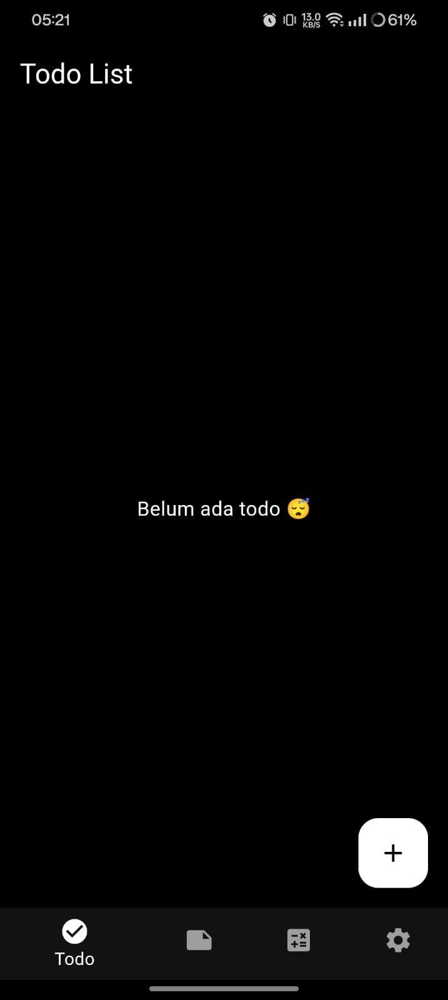
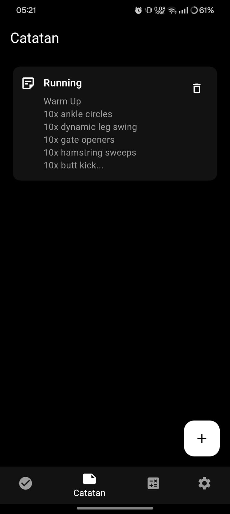
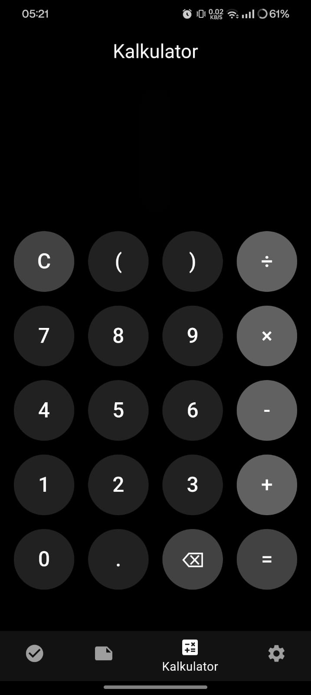

# 📱 GetX Todo + Notes + Calculator

*A modern Flutter application built with GetX for state management, featuring Todo management, Notes, Calculator, and multilingual support.*

---

## ✨ Features

### 🎯 **Todo Management**
- ✅ Create, edit, and delete todos
- ✅ Mark todos as completed
- ✅ Clean and intuitive interface
- ✅ Persistent storage with GetStorage

### 📝 **Notes App**
- 📖 Create and manage notes
- 📖 Rich text editing
- 📖 View note details
- 📖 Delete notes functionality

### 🧮 **Calculator**
- ➕ Basic arithmetic operations
- ➕ Scientific calculator functions
- ➕ Clean and modern UI

### 🌍 **Multilingual Support**
- 🌐 English and Indonesian languages
- 🌐 Dynamic language switching
- 🌐 Localized UI elements

### 🎨 **Theme Support**
- 🌙 Dark and Light mode
- 🌙 Dynamic theme switching

---

## 📱 Screenshots

<table>
  <tr>
    <td align="center"><b>Todo</b></td>
    <td align="center"><b>Notes</b></td>
    <td align="center"><b>Calculator</b></td>
    <td align="center"><b>Settings</b></td>
  </tr>
  <tr>
    <td>
      
    </td>
    <td>
      
    </td>
    <td>
      
    </td>
    <td>
      
    </td>
  </tr>
</table>

---

## 📋 Changelog

See [CHANGELOG.md](CHANGELOG.md) for a complete list of changes.

## 📄 License

This project is licensed under the MIT License - see the [LICENSE](LICENSE) file for details.
